*COMPANY*: CODTECH IT SOLUTIONS

*NAME*: GANESH BANKURU

*INTERN ID*: CT06DF1421

*DOMANIN*: CLOUD COMPUTING

*DURATION*: 6 WEEKS

*MENTOR*: NEELA SANTOSH

Task 4: Cloud Security — IAM Policies, Secure Storage, and Data Encryption
Objective: Configure custom IAM policies
Secure an S3 bucket (or existing EC2/S3)
Enable server-side encryption
Prepare a report with screenshots detailing the setup

Step 1: Create a Custom IAM Policy
Allows specific access to only one S3 bucket.

Step 1:
Go to IAM → Policies → Create Policy
Select JSON, paste this:

{
  "Version": "2012-10-17",
  "Statement": [
    {
      "Sid": "AllowBucketAccessOnly",
      "Effect": "Allow",
      "Action": [
        "s3:ListBucket",
        "s3:GetObject",
        "s3:PutObject",
        "s3:DeleteObject"
      ],
      "Resource": [
        "arn:aws:s3:::instagramposts-store",
        "arn:aws:s3:::instagramposts-store/*"
      ]
    }
  ]
}
Click Next → Name it: S3AccessPolicy-Intern

Click Create Policy

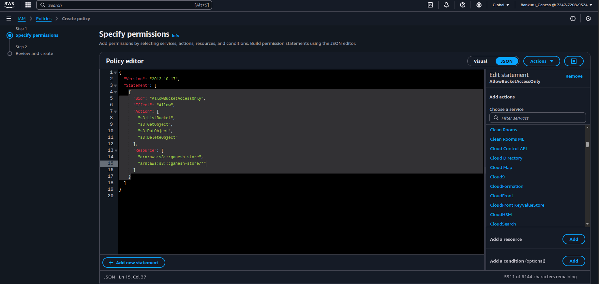

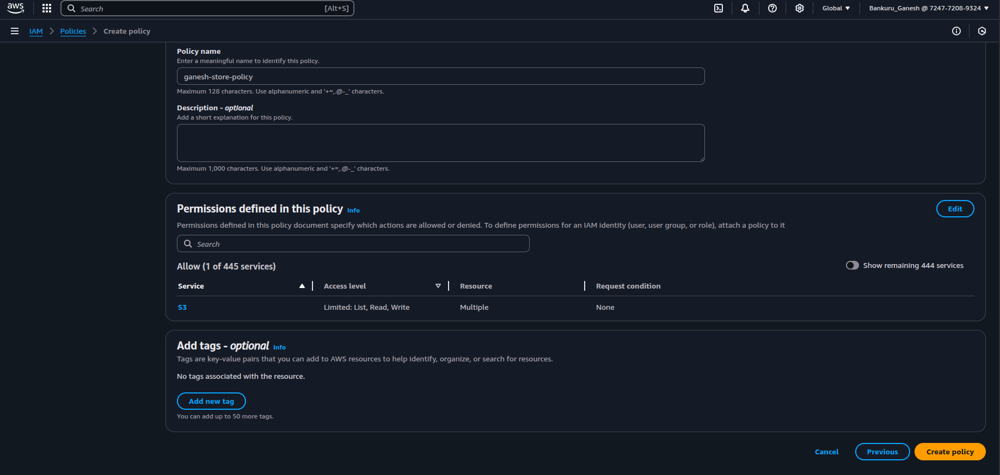

Step 2: Create an IAM User and Attach the Policy
Go to IAM → Users → Add User

Name: intern-user

Access type: Programmatic access

Attach the policy: S3AccessPolicy-Intern

Create and save the access key & secret key

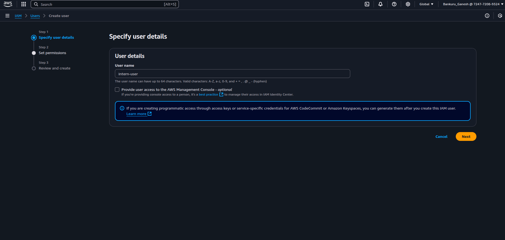

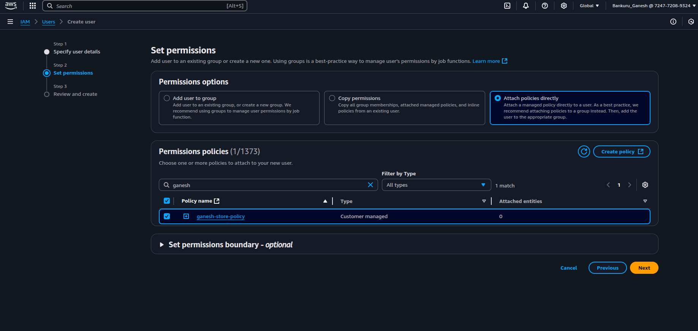

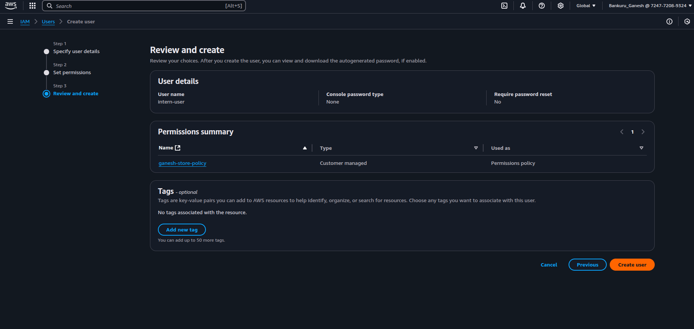

Step 3: Enable Secure Storage in S3
Apply security settings to your bucket (instagramposts-store)

Sub-Steps:

A. Disable Public Access
S3 → Bucket → Permissions → Block Public Access

Enable all block options

B. Enable Encryption (Server-Side)
Go to S3 → Bucket → Properties

Scroll to Default encryption

Choose:

AES-256 (simple and free)
Save

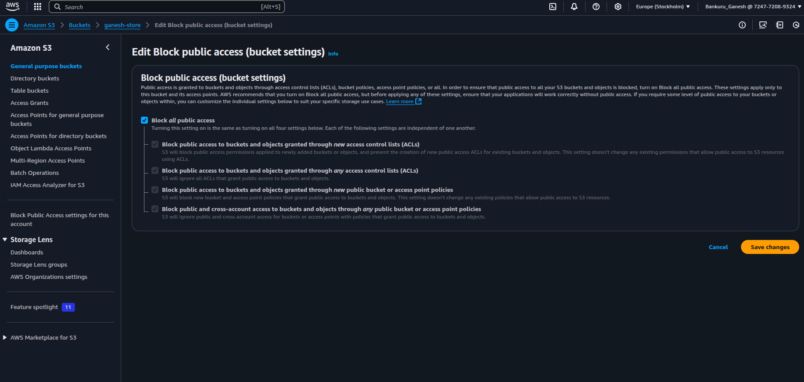

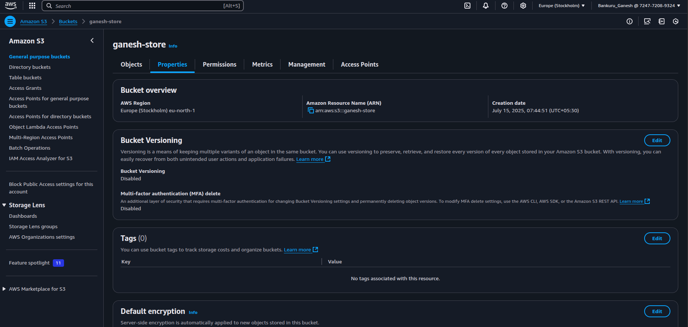

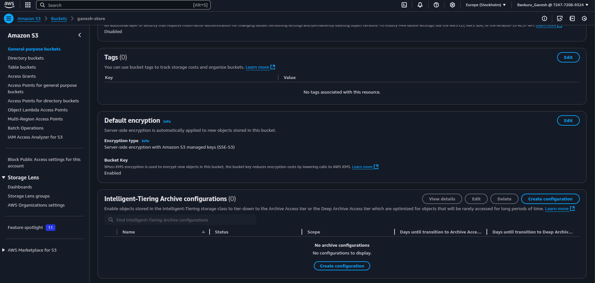

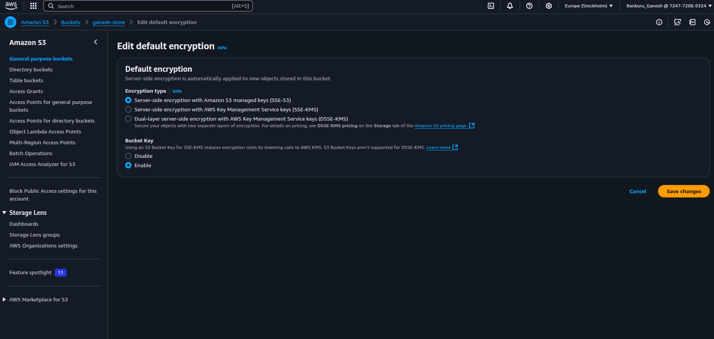

Upload a New File
Go to Objects tab inside your bucket

Click Upload

Upload a small test file (e.g., tempfile.txt)

Keep default permissions and settings — don’t change anything

Click Upload

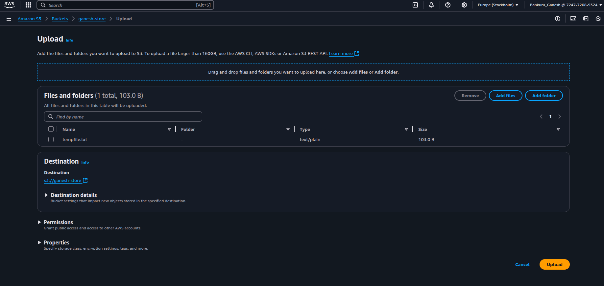

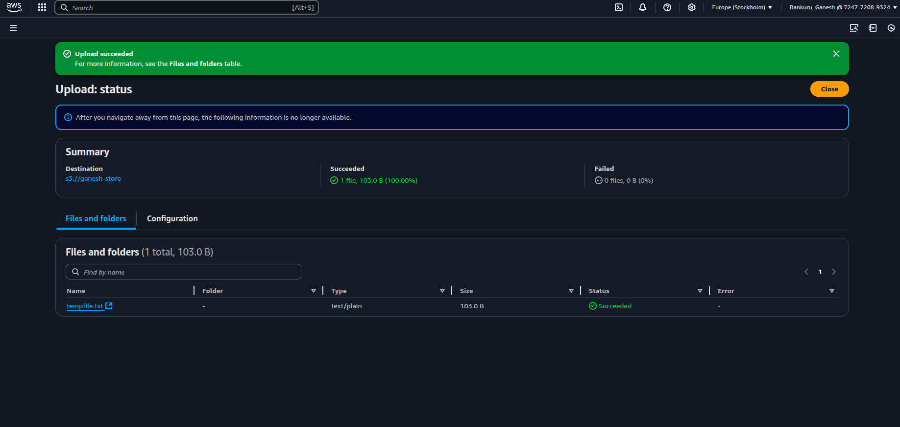

